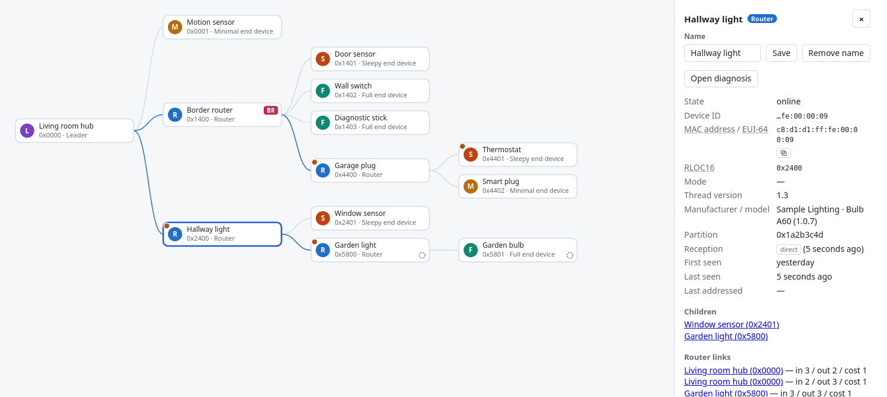
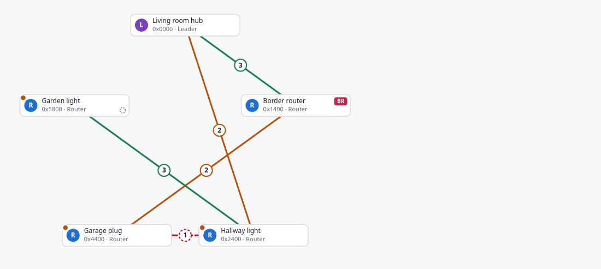
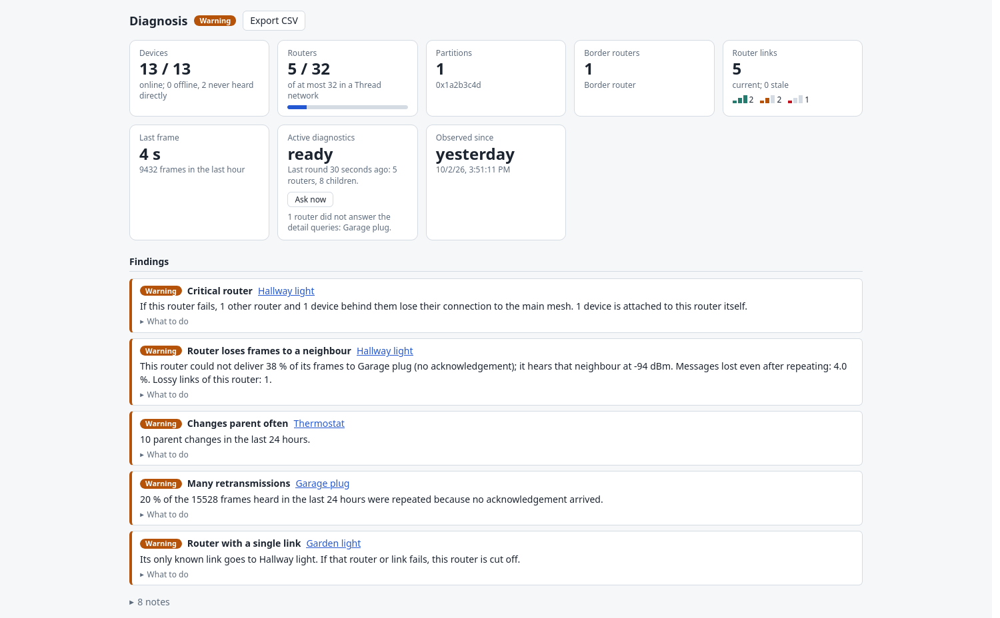
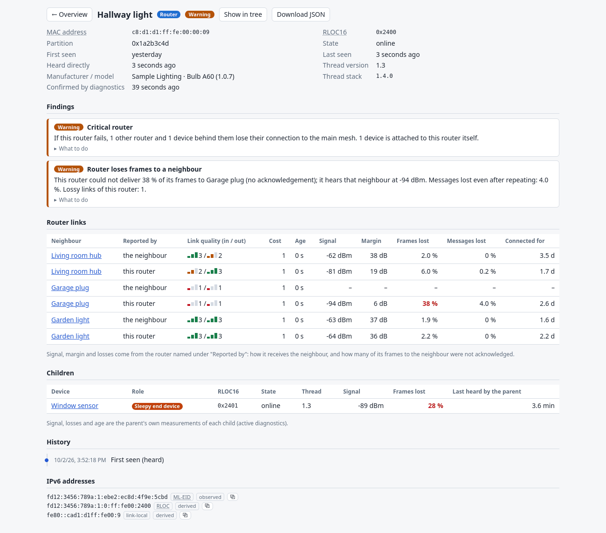

# Thread Tree

Standalone, passive visualizer for Thread networks (Matter-over-Thread, IKEA DIRIGERA, …).
A single 802.15.4 sniffer (nRF52840 or ESP32-C6/H2) listens on the Thread channel; Thread Tree
turns the decrypted traffic into a tree of **leader → routers → end devices** with roles,
all IPv6 addresses per node (a border router shows several), and router link quality.
No Home Assistant, no changes to your network. UI in English and German, with a legend for every abbreviation.
Optionally a second nRF52840 joins as an end device and *asks* the network what the routers measure themselves
(Thread versions, MAC addresses of all children, signal and error rates of every link, manufacturer): see
[Active diagnostics](#active-diagnostics-optional).

**Status: v0.1. The passive pipeline (nRF52840 sniffer, tshark, engine, UI) has run on a real network (Raspberry Pi,
IKEA DIRIGERA); the active diagnostics are tested against recorded real output and a simulated stick, not yet live on
hardware (see "Verification status").**

## Screenshots

Made with the demo network (`python3 -m thread_tree demo`: simulated devices with made-up names, including the active
diagnostics). The UI is available in English and German, light and dark.

**Tree:** leader, routers and end devices with roles; the side panel shows a device (names are yours, the MAC address
and all IPv6 addresses are listed, the dotted circle marks a device the sniffer never heard directly).



**Mesh:** router links by quality (colour and number); a dashed line with a dashed ring means the router loses 25 % or
more of its frames on that link (active diagnostics).



**Diagnosis:** network overview with the state of the active diagnostics, and the findings with an explanation.



**Device page:** findings, and per link the signal, margin and loss the routers measure themselves, children with their
parent's measurements, history.



## Quick start

```sh
python3 -m thread_tree demo            # simulated network, no hardware; http://127.0.0.1:8787
python3 -m unittest discover -s tests  # tests
```

With hardware (needs `tshark` from Wireshark; nothing else, no Python dependencies):

```sh
python3 -m thread_tree run --source nrf:/dev/ttyACM0     # then open the UI -> Settings -> enter the dataset
python3 -m thread_tree run --source nrf:/dev/ttyACM0 --channel 17
python3 -m thread_tree run --source iface:<nrf-sniffer-interface>
python3 -m thread_tree run --source pcap:capture.pcapng   # replay
python3 -m thread_tree run --source cmd:"your-esp32-sniffer-bridge --port /dev/ttyACM0"  # writes pcap to stdout
python3 -m thread_tree dataset                            # decode a dataset (prints no secrets)
python3 -m thread_tree run --source nrf:/dev/ttyACM0 --diag-port /dev/serial/by-id/<CLI stick>   # + active diagnostics
```

**Thread dataset.** It provides the network key (needed to decrypt), the channel (used by `nrf:`), the PAN ID filter
and the mesh-local prefix. Enter it in the UI under **Settings** (e.g. copy it in the IKEA app: Hub settings -> Thread
network -> More options -> copy dataset; or `ot-ctl dataset active -x`). Saving validates it, stores it in
`<db>.dataset` (mode 600) and restarts the capture with the new key and channel; learned nodes are kept. Alternatively
give it on startup via `THREAD_TREE_DATASET` (preferred over `--dataset`, keeps it out of shell history); then the form
is read-only. The key is never returned by the API. Without a key only MAC-level data is visible; the UI says so.

Security notes: the web server listens on all IPv4 interfaces by default (`--host 0.0.0.0`; `--host ::` for IPv6,
`--host 127.0.0.1` for this machine only) and has **no authentication**: anyone on the network can view the topology
**and enter or remove the Thread dataset**. The key is never sent back, but it travels unencrypted over HTTP when you
enter it (the UI warns on non-local connections). To restrict entry to the machine itself use `--local-config-only` and an
SSH tunnel (`ssh -L 8787:localhost:8787 pi@host`, then open `http://localhost:8787`). Config requests need
`Content-Type: application/json` and a matching `Origin` (guards against other web pages); with `--local-config-only` a
local `Host` name is required too (defeats DNS rebinding). Known limitation: the key is passed to tshark on its command
line, so other local users of the same machine can see it in the process list.

**Matching devices with Home Assistant (or any other tool).** The table's filter box accepts what Home Assistant shows
under "Matter info": a MAC address (8 bytes = Thread EUI-64, or 6 bytes = Ethernet/Wi-Fi) in any notation (`:`, `-`, none,
upper or lower case) and IPv6 addresses in any notation. A 6-byte MAC also finds nodes that have the matching SLAAC
address (modified EUI-64). Then name the node. Note: a Matter bridge that HA reaches over Ethernet (e.g. DIRIGERA) shows
its *Ethernet* MAC there, which is not its Thread radio's EUI-64; match such devices by IPv6 prefix or by hand.

**Device names.** Select a node and type a name in the detail panel (empty = remove). Names are shown in the tree, the
table (searchable) and the detail panel, and stored in the database. A name is bound to the node's extended address,
so it stays with the device when it re-parents and survives pruning. A node known only by its short address (RLOC16)
can be named too, but if that short address is reassigned the name may end up on another device; the UI says so.
Naming follows the same access rule as the dataset (`--local-config-only` restricts it to this machine).

**Rebuild tree.** The header button clears everything learned from traffic (nodes, links, leader, learned prefix) and lets the
network be learned again, e.g. after devices were removed or moved. Names are kept: they are tied to MAC addresses and
reappear when a device is seen again; names of nodes known only by short address are dropped. The Thread dataset and
the capture are not touched. Same access rule as naming.

State is stored in SQLite (`--db`, default `./thread-tree.sqlite`) every 30 s and on SIGTERM/Ctrl+C, so nodes, roles,
addresses, statistics and history survive restarts (nodes unseen for 30 days are pruned). Statistics are written
incrementally (only the 10-minute buckets that changed), the database runs in WAL mode: little write load for an SD card.

## Diagnosis view

The **Diagnosis** tab (the header buttons: Tree, Mesh, Table, Diagnosis) turns what the sniffer hears into numbers and
findings. A coloured dot on a card in the tree marks nodes with a warning or critical finding.

- **Overview:** devices online/offline, router count (limit 32), partitions, border routers, router links (current, stale,
  quality), last frame / decryption rate of the capture, observation start; the findings of the network and of all
  devices (warnings and critical ones open, plain notes folded away); a sortable, filterable table with frames per hour,
  retransmissions, RSSI, advertisement or poll interval, children, last heard (and the Thread version with active
  diagnostics). CSV export of that table.
- **Device page** (click a row, or "Open diagnosis" in the detail panel): findings with an explanation and what to do;
  signal (RSSI average/min/max, LQI, 24 h chart with the weak threshold, distribution); traffic (frames by kind,
  retransmissions, data volume, frames other devices addressed to it, 24 h activity chart); timing (advertisement or poll
  interval); router links with quality in/out (with active diagnostics also the signal and loss the routers measure);
  parent or children; history of events; addresses; JSON download.
- **History** (kept 30 days, 200 per device): first seen, role, parent (with the short address that came with it), short
  address, partition, border router, online/offline, MAC address learned.

All of it, except the values marked as active diagnostics, is measured **at the sniffer**: RSSI/LQI are what the sniffer
received, retransmissions are repeated frames it heard (same sequence number to the same destination within 0.5 s),
"frames/h" counts what reached it. A device far from the sniffer looks weak and quiet without being so; findings are
hints, not proof.

| Finding | Severity | When |
|---|---|---|
| Offline | critical for a leader or a router with children, else warning | no frame for longer than usual for its role (routers 15 min, sleepy devices 6 h) |
| Critical router | warning | removing it splits the known router mesh; says how many routers/devices are cut off |
| Router with a single link | warning | only one fresh two-way link, at least 3 routers |
| All links weak / uneven link | warning / note | all links LQ 1 / in and out differ by 2 or more |
| Changes parent often | warning | 3 or more parent changes in 24 h |
| Router changes address or role often | warning | 3 or more in 24 h |
| Many retransmissions | warning | 15 % or more of at least 50 frames (24 h) |
| Very frequent advertisements | warning | more than 360 per hour after 30 min of observation (stable: about 110) |
| Weak signal at the sniffer | note | average below -85 dBm over at least 20 measurements |
| Parent offline / unknown, not heard directly, MAC unknown | warning / notes | |
| Network: sniffer silent, decryption failing | critical | no frame for 60 s while capturing / more failures than successes |
| Network: partitions, leader changes, many offline, router limit | warning | |
| Network: no / single border router, near the router limit | note | |
| Active: router loses frames to a neighbour | warning | the router could not deliver 25 % of its frames (or 5 % of its messages) to a neighbour |
| Active: poor link to its parent | note / warning | parent hears it at -90 dBm or weaker, or loses 25 % of the frames (5 % of the messages: warning) |
| Active: parent has not heard it for a long time, router does not answer detail queries | notes | 80 % of the child timeout; usually an older Thread stack |
| Active: not heard directly, confirmed by diagnostics; diagnostics not working | note / warning | |

The thresholds are constants at the top of `thread_tree/diagnose.py`. API: `/api/diagnostics` (summary and findings),
`/api/nodes/<id>/diagnostics` (device page as JSON), `/api/export/nodes.csv`; `/api/topology` carries a `health` per node.

## Which stick needs which firmware

Both jobs use an nRF52840 stick, but with **different firmware**. One stick does one job at a time; to use both
(sniffer and active diagnostics) you need two sticks.

| Job | Firmware | Where | Tells the program |
|---|---|---|---|
| **Sniffer** (passive: frames, signal, statistics) | Nordic's *nRF Sniffer for 802.15.4*, appears as USB `1915:154b` | [firmware/nordic-sniffer/](firmware/nordic-sniffer/) (Nordic's license, not GPL) | `--source nrf:/dev/ttyACM…` (+ Nordic's extcap script, see below) |
| **Diagnostic node** (active: asks the routers) | OpenThread CLI with `meshdiag`, built by this project's [GitHub workflow](.github/workflows/firmware-diag.yml), appears as `OpenThread Device` | [release `firmware-diag-2026-10-03`](https://github.com/thomasjanker/thread-tree/releases/tag/firmware-diag-2026-10-03), steps in [docs/diagnostics.md](docs/diagnostics.md) | `--diag-port /dev/serial/by-id/…` |

Only one of them is needed to start: without a sniffer use `--source "cmd:sleep 1000000"` together with `--diag-port`
(no radio statistics then); without a diagnostic node use just the sniffer.

## Raspberry Pi + Nordic nRF 802.15.4 sniffer (setup that worked in testing)

0. Flash the sniffer firmware onto the stick: [firmware/nordic-sniffer/](firmware/nordic-sniffer/) has Nordic's hex for the
   nRF52840 Dongle with checksum and flashing steps (Nordic's license, not GPL); other boards and newer versions:
   [NordicSemiconductor/nRF-Sniffer-for-802.15.4](https://github.com/NordicSemiconductor/nRF-Sniffer-for-802.15.4).
1. `sudo apt install tshark python3-serial git`; add your user to `dialout` and `wireshark`; log in again.
2. Install Nordic's extcap script (run as your user, not root, the extcap folder is per user):
   `git clone https://github.com/NordicSemiconductor/nRF-Sniffer-for-802.15.4`, copy `nrf802154_sniffer.py` to
   `~/.config/wireshark/extcap/` and `chmod +x` it. `lsusb` shows the dongle as "nRF 802154 Sniffer" (1915:154b).
3. Find the channel: the dataset has it (`python3 -m thread_tree dataset`). Without the dataset, scan channels 11-26
   with `--capture ... --channel N --fifo /tmp/chN.pcap` and compare. Zigbee networks look similar (Dirigera's Zigbee is
   often on channel 11): a Zigbee channel shows `zbee_nwk` in `tshark -r ... -q -z io,phs`, Thread shows 6LoWPAN/MLE.
4. Thread encrypts MLE with a key derived from the network key; Wireshark's defaults (`thread.thr_use_pan_id_in_key: FALSE`,
   `thread.thr_auto_acq_thr_seq_ctr: TRUE`) already fit. Without the key the UI shows a warning.

## How the tree is derived (all passive)

| Shown | Source |
|---|---|
| Routers, leader | MLE advertisements (Source Address, Leader Data TLVs) |
| Router links + quality | Route64 TLV (link quality in/out, cost) |
| Parent of an end device | RLOC16: parent router ID = `rloc16 >> 10` (recomputed, never stored) |
| MED / SED / FED | Mode TLV in Parent/Child ID/Child Update Requests; MAC data polls mark sleepy |
| Border router flag | Network Data (Border Router / Has Route RLOC16s) |
| MAC address (EUI-64) | transmitter/destination of frames; links a short address to its MAC when a parent answers a child's attach request (Child ID Response: destination MAC + assigned Address16) |
| Reception: direct / indirect | direct = the sniffer received a frame transmitted by that node itself; indirect = known only from others' traffic (out of range) |
| Link-local, RLOC, ALOC | derived from EUI-64 / RLOC16 / mesh-local prefix (marked "derived") |
| ML-EID, OMR/GUA | Address Registration of children, Address Notification (marked "observed"); with active diagnostics also the routers' and children's own address lists |
| Thread version, manufacturer / model, signal and loss of links, child MAC addresses | active diagnostics only (`meshdiag`, `networkdiagnostic`), see below |

Limits: only what the sniffer hears; sleepy devices appear slowly; a REED cannot be told from a FED;
router-to-router links need that router's advertisement to reach the sniffer.

## Active diagnostics (optional)

A second nRF52840 with OpenThread CLI firmware joins the network as an **end device** (router role disabled: no router ID,
no influence on routing) and asks it: every router with Thread version, MAC and IPv6 addresses and links in both
directions, the signal and error rates the routers measure for each neighbour, all children with MAC addresses and the
parent's view of each link, Network Data, and manufacturer / model where devices answer. This fills in what the sniffer
cannot hear (devices out of its range, sleepy devices' MAC addresses) and shows weak links by what the routers lost,
not by what reached the antenna.

```sh
python3 -m thread_tree diag-probe --list-ports        # find the serial device of the CLI stick
python3 -m thread_tree run --source nrf:/dev/serial/by-id/<sniffer> --diag-port /dev/serial/by-id/<CLI stick>
```

Needs the dataset (Settings or `THREAD_TREE_DATASET`) and the diagnostic firmware on the stick (prebuilt in the
[releases](https://github.com/thomasjanker/thread-tree/releases/tag/firmware-diag-2026-10-03), pre-release; the standard
prebuilt images lack `meshdiag`). One round every `--diag-interval` seconds (default 300), one request at a time; the
Diagnosis tab has a card with the state and an "Ask now" button (`POST /api/diagnostics/run`). The node is a participant
of your network, so it shows up as a device (tag *diagnostic node*), and the stick keeps the dataset in its flash. In
the first real test the routers with Thread 1.3 did not answer the detail queries: they appear with a note and are asked
again only after 6 hours. What is asked, what shows where, the findings, how the node joins and the limits:
[docs/diagnostics.md](docs/diagnostics.md).

## Limits of passive capture

- **Same router ID in two partitions at once.** While a network re-forms (e.g. a border router restarts), two partitions
  can coexist for a short time and use the same router ID. The short-address index is global, so the assignment flips
  between the two devices until the partitions merge. Other Thread networks are excluded by the dataset's PAN filter.
- **Short address reused without the sniffer noticing.** If a child re-attaches elsewhere unnoticed and its old short
  address is given to another device, frames that carry only the short address are attributed to the old device,
  including its name. A captured attach (Child ID Response) or any frame with the device's MAC address corrects it.
  The detail panel says when a named device has been heard only by its short address for more than an hour.

## Verification status (honest)

Verified here: engine, topology, persistence, dataset parser, address math, EK adapter logic
(on synthetic EK input), CLI, server endpoints, graceful SIGTERM flush, statistics, history, findings, restart round trip.
The diagnosis statistics rely on Wireshark fields taken from its field reference and source (`wpan-tap.rss`, `wpan-tap.lqi`,
`wpan.seq_no`, `wpan.frame_type`, `frame.len`, `wpan-tap.length`); they are resolved against `tshark -G fields` at startup
and a missing one disables only that statistic (with a warning), but they have not been seen on real traffic yet.
**Not verified (no hardware / tshark / browser in the dev environment):**
1. Real tshark output: field names come from the Wireshark field reference and are resolved against
   `tshark -G fields` at startup (missing ones disable a feature and log a warning), but EK key naming
   and Route64 entry alignment are untested on real traffic.
2. Decryption option `uat:ieee802154_keys:"<key>","1","Thread hash"` in `capture.py`.
3. The web UI was rendered headless in Firefox (demo data, light and dark, English and German); it has not been used
   on a real network yet.
4. The ESP32-C6 pcap bridge (`cmd:` source). The nRF extcap piping (`--fifo /dev/stdout` into `tshark -r -`) was confirmed
   on a Raspberry Pi 2: frames, Thread PAN, RLOC16s and link-local addresses decode as expected.
5. Active diagnostics: the CLI stick, the firmware, `diag-probe` and the output of `meshdiag` ran on a real network (5
   routers); the parsers, one collection round, findings and the UI are tested against the anonymized transcript of that
   run, the joining and the rounds against a simulated stick (pseudo terminal). Not yet run live together with the sniffer
   (`run --diag-port`), and no real answer to `networkdiagnostic get ... 25 26 27 28` (manufacturer, model) has been
   recorded: the parser follows OpenThread's source.

First hardware step: capture a few minutes with the sniffer, run `tshark -r cap.pcapng -T ek` by hand
next to `thread-tree run --source pcap:cap.pcapng`, and compare.

## Layout

```
thread_tree/addresses.py  EUI-64 / RLOC16 / IPv6 classification
thread_tree/engine.py     observations -> persistent node model, history events (tick)
thread_tree/stats.py      per-node counters, RSSI, intervals, 10-minute buckets
thread_tree/diagnose.py   findings, network summary, device detail, CSV
thread_tree/presence.py   online/offline rules
thread_tree/topology.py   snapshot + spanning tree (leader root, best-LQ router paths)
thread_tree/ek.py         tshark EK -> engine calls (field table)
thread_tree/capture.py    pcap / interface / command / EK sources
thread_tree/store.py      SQLite persistence
thread_tree/runtime.py    capture and diagnostics lifecycle + dataset (UI/CLI), private dataset file
thread_tree/otcli.py      serial client for the OpenThread CLI (one command at a time, cancellable)
thread_tree/otdiag.py     parsers for meshdiag / netdata / leaderdata output (tested on a real transcript)
thread_tree/collector.py  active diagnostics: join as end device, rounds of questions, engine updates
thread_tree/diagprobe.py  diag-probe: what can the stick ask? (transcript without secrets)
thread_tree/simulate.py   demo network incl. simulated active diagnostics
thread_tree/server.py     stdlib HTTP: topology, diagnostics, export, config, static UI
firmware/nordic-sniffer/  Nordic's sniffer firmware (own license, see its folder), unmodified
thread_tree/web/          vanilla JS UI (tree, mesh, table, diagnosis views, charts, legend, en/de)
```

Matter support is planned as a later extension; the graph model is transport-agnostic.

## License

Copyright (C) 2026 Thomas Janker. Licensed under the GNU General Public License, version 3 or (at your
option) any later version. See [LICENSE](LICENSE). Exception: `firmware/nordic-sniffer/` contains Nordic Semiconductor's
firmware under Nordic's license (see the `LICENSE` file there).
